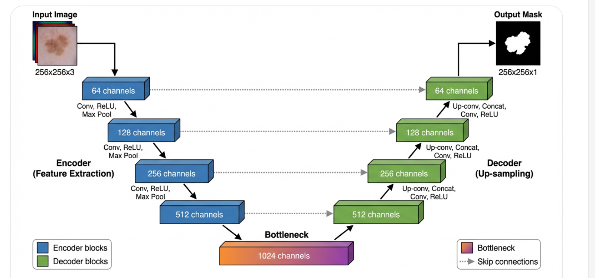
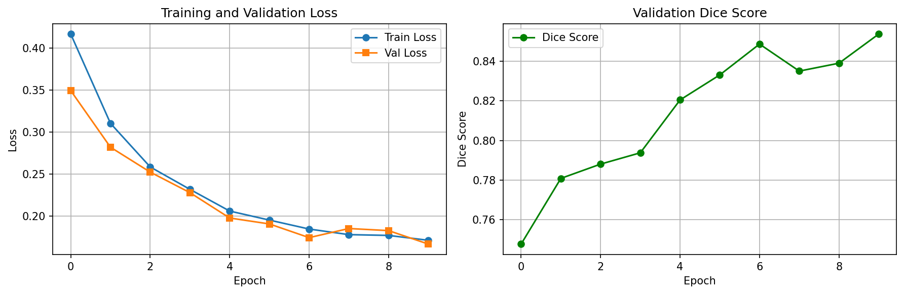
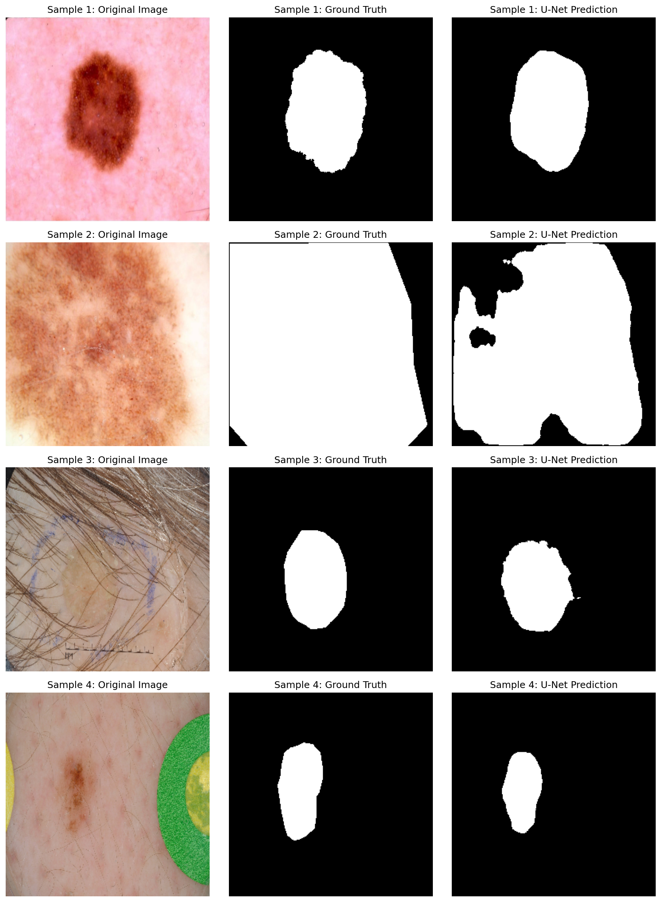

```markdown
<div align="center">

# 🩺 Explainable Skin Lesion Segmentation
### U-Net + Grad-CAM | ISIC 2018 

[](https://www.python.org/)
[](https://pytorch.org/)
[](LICENSE)
[](https://kaggle.com/)

### 🎯 Dice Score: 0.8538 | ⚡ Inference: 10ms/image | 🔥 Explainable AI

</div>

---

## 🎯 Overview

Skin cancer affects **5.4 million people annually**. Early detection saves lives — but manual analysis by dermatologists is slow and subjective.

This project builds an **explainable AI pipeline** that:
- ✅ Automatically segments skin lesions with **85.4% Dice Score**
- ✅ Explains model decisions using **Grad-CAM heatmaps**
- ✅ Processes images in **10 milliseconds** (real-time clinical use)
- ✅ Uses fully **open data** (ISIC 2018) for reproducibility

---

## 📊 Results At a Glance

| Metric | Our Model | Baseline |
|:---|:---:|:---:|
| **Dice Score** | **0.8538** | 0.8200 |
| **IoU Score** | **0.7445** | 0.7000 |
| **Val Loss** | **0.1663** | 0.2000 |
| **Inference Time** | **10ms** | — |

---

## 🏗️ Architecture



**31M parameters | Sigmoid output | ReLU hidden layers**

---

## 🔥 Grad-CAM Explainability

```
Traditional AI:   Image → Model → "Lesion detected" ❓
Our Approach:     Image → Model → "Lesion detected" + WHY ✅
```

**How to read heatmaps:**

```
🔴 Red / Yellow  →  Model focuses HERE  (important region)
🔵 Blue / Purple →  Model ignores this  (background)
```


*Model correctly focuses on lesion boundaries — not hair or artifacts*

---

## 📈 Training Progress

| Epoch | Train Loss | Val Loss | Dice |
|:---:|:---:|:---:|:---:|
| 1 | 0.4169 | 0.3494 | 0.7477 |
| 3 | 0.2584 | 0.2522 | 0.7881 |
| 5 | 0.2057 | 0.1974 | 0.8205 |
| 7 | 0.1843 | 0.1740 | 0.8488 |
| **10** | **0.1708** | **0.1663** | **0.8538** |



---

## 🔬 Sample Predictions



*Left → Right: Original Image | Ground Truth | Model Prediction*

---

## 📁 Project Structure

```
PURE-Skin-Lesion-Segmentation/
│
├── 📓 notebooks/
│   ├── 01_data_preparation.ipynb
│   └── 02_unet_gradcam.ipynb
│
├── 📊 results/
│   ├── gradcam_heatmaps.png
│   ├── training_curves.png
│   └── unet_results.png
│
├── 🧠 models/
│   └── best_unet_model.pth
│
├── 📄 Data/
│   └── train_data.csv
│   ├── train_bboxes.csv
│   ├── val_data.csv
│   └── val_bboxes.csv
│   ├── test_data.csv
│
└── 📖 README.md
```

---

## 🚀 Quick Start

```bash
# Clone repository
git clone https://github.com/your-username/-Skin-Lesion-Segmentation.git
cd PURE-Skin-Lesion-Segmentation

# Install dependencies
pip install -r requirements.txt

# Run notebook
jupyter notebook notebooks/02_unet_gradcam.ipynb
```

**Or run directly on Kaggle** → No setup needed ✅

---

## 🛠️ Tech Stack

```
PyTorch 2.0  |  Grad-CAM  |  OpenCV  |  NumPy  |  Matplotlib
```

---


## 🙏 Acknowledgments

| | |
|:---|:---|
| **ISIC Archive** | Open skin lesion dataset |
| **PyTorch Team** | Deep learning framework |
| **Kaggle** | Free GPU computing |

---

<div align="center">

**Asad Channa**
[](https://github.com/asadshahnawaz20)
[](https://www.linkedin.com/in/asad-channa-5bb6922a9)
[](mailto:drasadchanna657@gmail.com)


⭐ **Star this repo if it helped you!** ⭐

</div>
```

---


